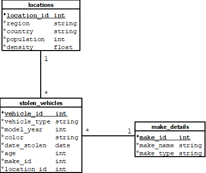

# New Zealand Vehicle Theft Analysis 

## Project Overview
Vehicle theft is a worldwide issue affecting many motorists. This project analyses motor vehicle theft patterns in New Zealand. The aim is to:
* Identify trends in vehicle theft by day, vehicle type, and region.
* Examine how vehicle age impacts theft likelihood.
* Discover which regions have the highest and lowest theft rates.

### Data Sources 
The dataset used in this analysis comes from Maven Analytics. It contains records on vehicle thefts in New Zealand over six months, from October 2021 to April 2022
* [Raw datasets](https://maven-datasets.s3.amazonaws.com/Motor+Vehicle+Thefts/Motor+Vehicle+Thefts+CSV.zip)
* [Cleaning script](https://github.com/RobelGiday/nz_vehicle_theft_analysis/raw/refs/heads/main/assets/cleaning%20datasets%20script)
* [Clean datasets](assets/cleaned_data)

#### Figure 1: Entity Relationship Diagram



## SQL Queries 
### Vehicle Thefts by Day
Monday has the highest number of vehicle thefts, with 761 incidents, while Saturday recorded the lowest, with
573 thefts. Vehicle thefts are generally more frequent on weekdays than weekends, likely due to reduced work
commutes and more vehicles securely parked at home. Therefore, thefts are more likely to occur on business
days. 

``` sql
SELECT 
	DATENAME(WEEKDAY, date_stolen) as day_of_week,
	COUNT(*) as num_of_thefts
FROM stolen_vehicles
GROUP BY DATENAME(WEEKDAY, date_stolen)
ORDER BY num_of_thefts DESC;
```

[Click here to view query results](assets/query_results/thefts_by_day.csv)

### Vehicle Thefts by Region 
Areas with higher population densities, like Auckland and Wellington, indicate that thefts occur more frequently in crowded areas, with 1625 thefts in Auckland and 416 thefts in Wellington. Although Nelson also has a high population density, it reports only 92 thefts, possibly due to better enforcement or low vehicle numbers. In contrast, regions with lower population densities tend to have fewer vehicles, which reduces the likelihood of theft. As A result, Southland and Hawke's Bay account for the lowest number of thefts in New Zealand, with 26 thefts in Southland and 100 thefts in Hawke's Bay.

``` sql
SELECT
	region,
	population,
	density,
	count(vehicle_id) AS num_of_thefts
FROM stolen_vehicles s 
JOIN locations l ON s.location_id=l.location_id
GROUP BY region, population, density
ORDER BY num_of_thefts DESC;
```

[Click here to view query results](assets/query_results/thefts_by_region.csv)

### Vehicle Thefts by Type and Region 
Auckland reports having the most vehicle thefts in New Zealand, with perpetrators stealing 326 saloons, 306 station wagons and 294 hatchbacks. Still significant but lower than Auckland, both Canterbury & Wellington have recorded many thefts. In contrast, rural regions like Gisborne and Southland report far fewer thefts. Thieves often target saloons, station wagons and hatchbacks because these vehicle types are widely available, making them easier to sell or dismantle for parts. Meanwhile, luxury, heavy-duty, and niche vehicles are rarely stolen due to their size, tracking technology, limited usability, and may have lower resale demand. 

```sql
SELECT 
	vehicle_type,
	region,
	COUNT(*) as num_of_thefts
FROM stolen_vehicles s 
JOIN locations l ON s.location_id=l.location_id
GROUP BY vehicle_type, region
ORDER BY num_of_thefts DESC;
```
[Click here to view query results](assets/query_results/thefts_by_vehicle_type_and_region.csv)

### Average Age of Stolen Vehicle Types
According to the datasets, station wagons and saloons are the most frequently stolen vehicle types, with an average age of 19 years. These vehicles are widely available and easily accessible for thieves to steal, with high resale demand for parts. Additionally, thieves may prefer mid-aged vehicles over very old or very new ones, possibly due to the absence of modern anti-theft technology. Regardless of age, thieves less often target articulated trucks and special-purpose vehicles, likely because they are equipped with anti-theft technology and have lower resale demand. 

``` sql
SELECT 
	vehicle_type,
	COUNT(*) AS num_of_thefts,
	AVG(age) AS avg_age
FROM stolen_vehicles
GROUP BY vehicle_type
ORDER BY num_of_thefts DESC;
```
[Click here to view query results](assets/query_results/avg_age_of_stolen_vehicles_by_type.csv)

## Conclusions 
Vehicle theft in New Zealand follows clear patterns in theft frequency and vehicle preferences. Theft is more frequent on weekdays, particularly Mondays, and more common in densely populated areas like Auckland and Wellington. Saloons, station wagons, and hatchbacks are prime targets due to accessibility and resale value. Mid-aged vehicles are stolen more often since they lack advanced security features. Insights from this data can help policymakers and law enforcement improve prevention strategies. By addressing vulnerabilities in high-theft regions and encouraging modern security measures, authorities can work towards reducing vehicle theft rates across the country. 

